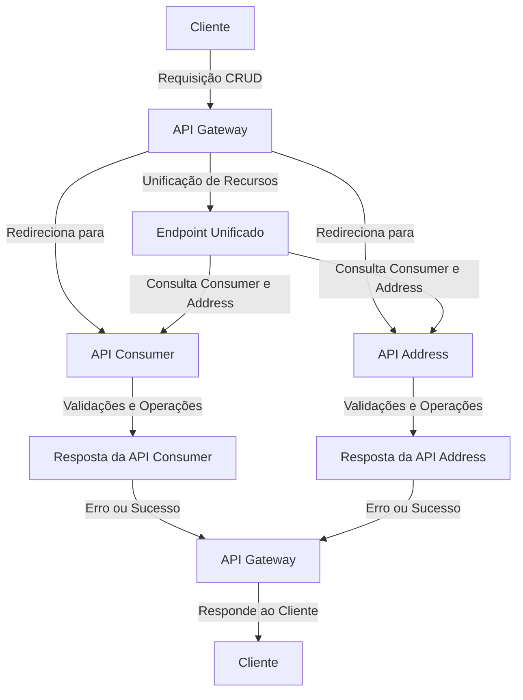

# Exemplo de Microsserviço

### Como testar

Para testar o projeto, é necessário executar os três projetos: `gateway`, `consumer-api` e `address-api` localmente.

Para realizar uma requisição, siga o padrão REST enviando a requisição para o `gateway` através da porta `8080`.

Exemplo:

**POST /consumer-address**

**Body:**
```json
{
  "name": "João da Silva",
  "age": 30,
  "email": "joao.silva@example.com",
  "address": {
    "street": "Rua das Flores",
    "city": "São Paulo",
    "zipCode": "12345-678",
    "state": "SP"
  }
}
```

## Desafio

Implemente as funcionalidades na API `gateway` para permitir a realização das demais operações do CRUD: leitura, atualização e exclusão, tanto de um `consumer` quanto de um `endereço`, de forma individual ou simultânea.

Além disso, refatore o código para torná-lo mais organizado e legível, melhorando também a lógica. Realize essas melhorias tanto no projeto `gateway` quanto nas demais APIs do projeto.

## IMPORTANTE

Utilize os logs para se orientar e acompanhar a execução das aplicações. Foram adicionados dois exemplos de logs, porém é necessário incluir mais exemplos para que seja possível compreender por onde os dados estão sendo processados.

# Tarefa: Completar o CRUD para `consumer` e `address` na API Gateway

Sua tarefa é completar o CRUD para os recursos `consumer` e `address`, garantindo que todas as operações passem pela API Gateway, que atua como unificador desses recursos.

Atualmente, cada API (`consumer` e `address`) possui um CRUD que ainda não foi implementado na API Gateway. É necessário desenvolver o código que unifica esses recursos na API Gateway, permitindo que tanto `consumer` quanto `address` possam ser acessados de forma separada ou unificada, sempre passando pela API Gateway.

A API Gateway já possui o fluxo de cadastro implementado, mas ainda falta a implementação de um mecanismo para tratar e responder adequadamente os erros que possam ser retornados pelas APIs `consumer` ou `address`.

## Importante

- As validações devem ser realizadas exclusivamente nas APIs `consumer` ou `address`.
- A API Gateway deve apenas redirecionar as requisições para os serviços corretos e responder de forma apropriada ao cliente que realizou a requisição.

---

## Tarefas de Melhoria do Código

### 1. Implementar as operações de leitura, atualização e exclusão na API Gateway:
- Criar endpoints na API Gateway para as operações de leitura, atualização e exclusão de `consumer` e `address`.
- Garantir que as requisições sejam redirecionadas para as APIs correspondentes (`consumer` ou `address`).

### 2. Unificar os recursos `consumer` e `address`:
- Implementar um endpoint na API Gateway que permita acessar os dados de `consumer` e `address` de forma unificada.
- Garantir que o cliente possa optar por acessar os recursos de forma separada ou combinada.

### 3. Tratar erros retornados pelas APIs `consumer` e `address`:
- Implementar um mecanismo na API Gateway para capturar e tratar os erros retornados pelas APIs `consumer` e `address`.
- Garantir que a API Gateway responda ao cliente com mensagens de erro claras e no formato adequado.

### 4. Adicionar logs detalhados:
- Incluir logs em todos os pontos críticos da API Gateway para facilitar o rastreamento do fluxo de requisições.
- Garantir que os logs contenham informações suficientes para identificar a origem de erros e o caminho percorrido pelas requisições.

### 5. Refatorar o código para melhorar a organização e legibilidade:
- Reorganizar o código da API Gateway para torná-lo mais modular e fácil de entender.
- Aplicar boas práticas de programação, como separação de responsabilidades e reutilização de código.

### 6. Documentar os endpoints da API Gateway:
- Atualizar a documentação da API Gateway para incluir os novos endpoints e suas funcionalidades.
- Fornecer exemplos de requisições e respostas para cada endpoint.

### 7. Testar o fluxo completo:
- Criar testes automatizados para validar o funcionamento de todos os endpoints da API Gateway.
- Garantir que os testes cubram cenários de sucesso e falha, incluindo erros retornados pelas APIs `consumer` e `address`.

